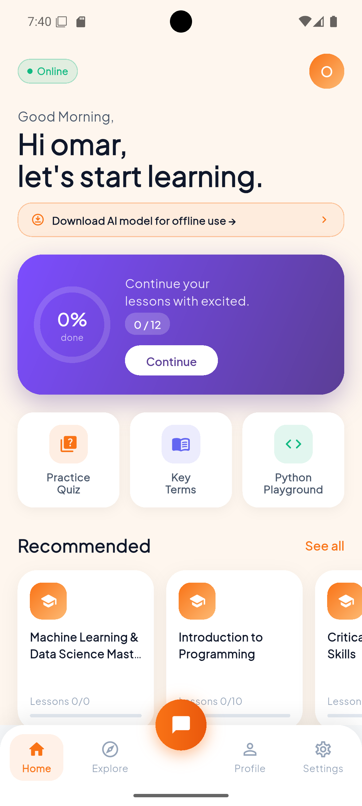
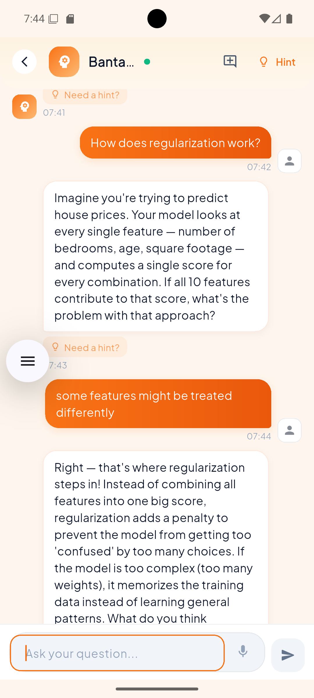
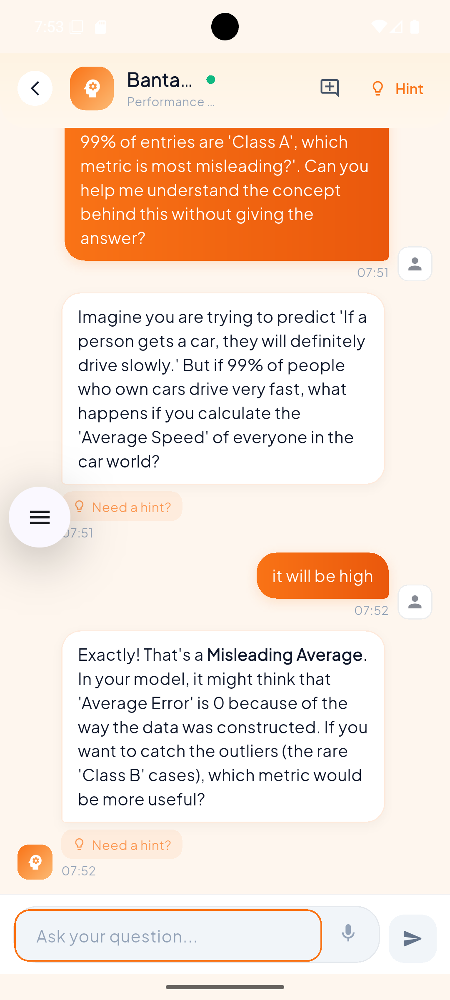
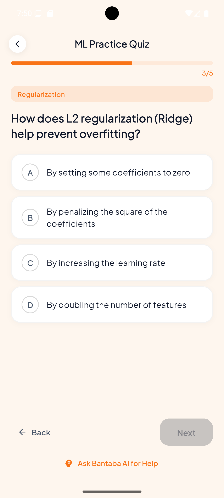
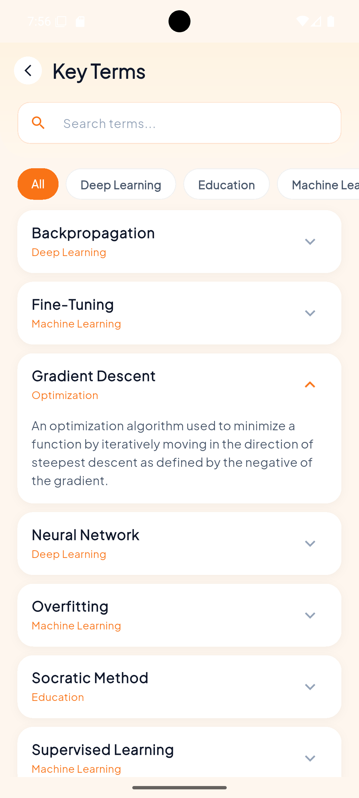
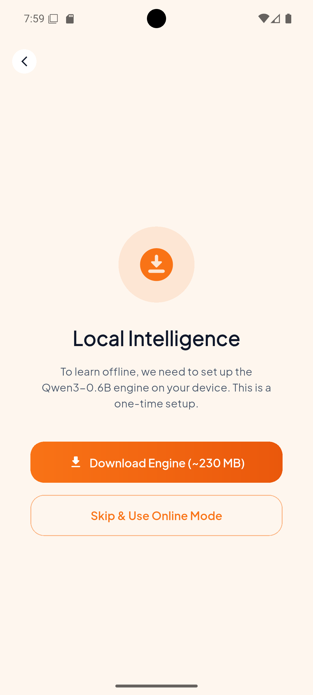
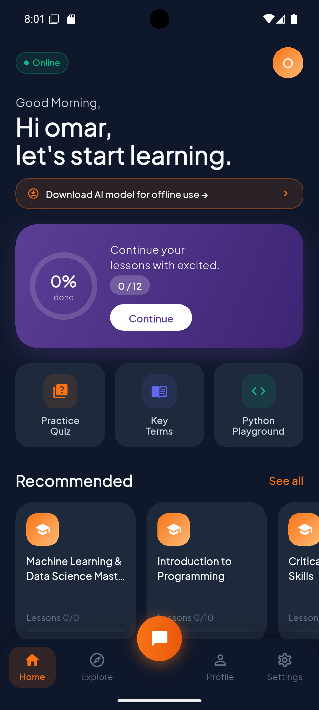
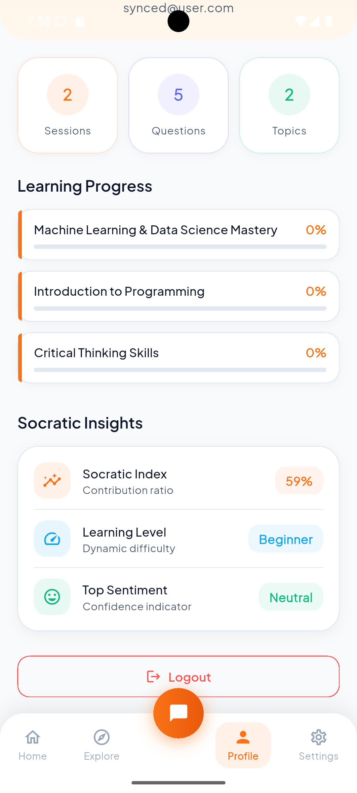

<div align="center">

# Socratic AI Tutor

### An AI that teaches by asking — not by telling.
### Works offline. Runs on your phone. No cloud required.

[](https://socratic.hx-ai.org/)
[-green?style=for-the-badge&logo=android)](https://github.com/O-keita/socratic_ai_tutor/releases/download/v1.0.0/bantaba-ai-v1.0.0.apk)
[](https://github.com/O-keita/socratic_ai_tutor)

</div>

---

## The Problem

Most AI tutors do the thinking for you.

You ask "What is gradient descent?" and they explain it in four paragraphs. You read it, nod along, close the app — and five minutes later, you can't explain it yourself. That's not learning. That's just reading with extra steps.

There's a second problem too: most AI tools require a stable internet connection. For millions of technology learners in low-resource environments, that is not a guarantee.

---

## The Solution

**Socratic AI Tutor** is a hybrid offline-first mobile application that teaches Data Science and Machine Learning the way the greatest minds have always taught: through questions.

The AI never gives you the answer. It asks the question that makes you find it yourself.

> *"What do you think happens to the model when the learning rate is too high?"*
> *"What does a gradient tell you about the shape of the loss surface?"*
> *"If you had to explain overfitting to a 10-year-old, where would you start?"*

And it works **completely without internet** — a full language model runs directly on your Android device, no server needed.

---

## What Makes This Different

### 1. An AI That Refuses to Give Answers

This is not a system prompt trick. The model was **fine-tuned** on 307 Socratic teaching conversations. It behaves at the weight level — it cannot help but guide you.

- Ask a conceptual question → receive a guiding question back
- Ask a coding question → get pushed to write the code yourself
- Say "just tell me" → get a small hint, then another question

The model auto-detects your intent (conceptual / code / casual) and shifts its approach accordingly. Struggle is the feature, not the bug.

### 2. A Full LLM Running On Your Phone — No Internet

Every existing Flutter package for on-device LLM inference was broken:

| Package | Problem |
|---------|---------|
| `llama_cpp_dart` | pub.dev strips git submodules — ships without llama.cpp source |
| `llamadart` | Pre-built binaries use ARMv8.2+dotprod — SIGILL crash on older CPUs |
| `llama_flutter_android` | Crashes during inference |

So we built our own.

**`libchat`** is a custom C API (~235 lines) that wraps llama.cpp and compiles from source directly into the APK via CMake. Zero third-party inference packages. Zero dependency on pub.dev for the inference layer.

```c
chat_session * chat_create(const char * model_path, int n_ctx, int n_threads);
char * chat_generate(chat_session * session, const char * user_message);
void chat_string_free(char * str);
void chat_destroy(chat_session * session);
```

```
Flutter (Dart)  →  dart:ffi  →  libchat.so  →  llama.cpp (compiled from source)
```

It runs on every ARM64 Android device. Baseline CPU targets only — no dotprod, no SVE, no OpenCL. It just works.

### 3. Intelligent Hybrid Routing

The app does not make you choose between online and offline. `HybridTutorService` decides automatically:

```
Network available?         → Remote FastAPI backend (faster, always up to date)
No network?                → Local libchat engine (100% offline)
Previous inference crash?  → Block local, route remote (SIGILL protection)
Previous model load crash? → Block local, route remote (OOM protection)
```

The transition is invisible. Students keep learning. The infrastructure adapts around them.

### 4. A Fine-Tuned Model — Not a Prompted One

**Base**: Qwen3-0.6B — 600M parameters, natively supports chain-of-thought reasoning via `<think>` blocks.

**Fine-tuned with:**
- 234 Socratic teaching conversations (ML/DS concepts, algorithms, data fundamentals)
- 73 supplementary samples (code guidance, greetings, edge cases)
- Augmented to ~991 training examples via conversation windowing
- LoRA (r=32, RSLoRA) on all attention + MLP projections
- 4 training epochs on Google Colab A100

**Quantized** to GGUF Q4_K_M (~460 MB) for mobile deployment. The model generates internal `<think>...</think>` reasoning before every response — deliberation that improves pedagogical quality, stripped before display.

Full training pipeline: [`notebooks/training/Qwen3_0_6B.ipynb`](notebooks/training/Qwen3_0_6B.ipynb)

---

## Everything It Does

| Feature | Description |
|---------|-------------|
| **Socratic Chat** | AI guides through questions, never answers directly. Adapts to conceptual, code, and casual messages. |
| **100% Offline Mode** | Full LLM inference on ARM64 via custom `libchat` C API. No internet after model download. |
| **Hybrid Routing** | Auto online/offline switching with manual override and crash-loop protection. |
| **DS/ML Curriculum** | Bundled courses: Neural Networks, Linear Regression, Statistics, Feature Engineering, Python. |
| **Adaptive Quizzes** | Difficulty adjusts based on performance history. |
| **Python Playground** | Full Python runtime (Pyodide/WebAssembly) running inside the app. |
| **Glossary** | Searchable ML/DS terminology with definitions. |
| **Progress Tracking** | Lesson completions and quiz scores saved locally, synced when online. |
| **Light & Dark Mode** | High-contrast orange/dark-blue theme. Preference persisted. |
| **Admin Dashboard** | Upload courses, manage content, view analytics at `/admin`. |
| **Model Management** | Download, resume, and reset the local GGUF model from Settings. |

---

## Performance

| Device | Architecture | Online | Offline | Offline Support |
|--------|-------------|--------|---------|----------------|
| Android Emulator | x86_64 | 8.5s avg | — | No (remote only) |
| Huawei P Smart (4 GB) | ARM64 | 6.4s avg | 5–7s | Yes |
| Modern Android (6 GB+) | ARM64 | 4–7s | 5–7s | Yes |

- Socratic Index: **0.60–0.65** maintained across all devices and modes
- Offline success rate: **100%** on tested ARM64 devices
- APK size: **58 MB** (model ~460 MB downloaded separately on first launch)

---

## App Screenshots

#### Core Learning Experience

| Home | Socratic Chat | AI Guidance |
| :---: | :---: | :---: |
|  |  |  |

#### Offline on a Real Device

| Toggle Offline | Offline Chat | WiFi Off — Still Responding |
| :---: | :---: | :---: |
|  |  |  |

#### Full Learning Suite

| Adaptive Quizzes | Glossary | Python Playground |
| :---: | :---: | :---: |
|  |  |  |

#### Setup & Theme

| Model Download | Dark Mode | Profile |
| :---: | :---: | :---: |
|  |  |  |

---

## Tech Stack

```
Mobile App         Flutter 3.19 (Dart)
On-Device AI       libchat C API → llama.cpp (compiled from source, CMake)
FFI Bindings       dart:ffi → libchat.so
Hybrid Router      HybridTutorService (auto edge/cloud switching)
Remote AI          FastAPI + llama-cpp-python
Model              Qwen3-0.6B fine-tuned, GGUF Q4_K_M, ~460 MB
Backend            FastAPI + Python 3.10 + Docker
Admin Panel        React 18 + TypeScript + Vite + Tailwind CSS
Deployment         DigitalOcean (Docker)
Storage            SharedPreferences, FlutterSecureStorage, PathProvider
Networking         Dio (with HTTP Range resume), ConnectivityPlus
```

---

## Deployment

**Production backend** is live at [socratic.hx-ai.org](https://socratic.hx-ai.org/), running on DigitalOcean via Docker.

```bash
# Verify it's up
curl https://socratic.hx-ai.org/health
# {"status": "ok"}

# Test inference
curl -X POST https://socratic.hx-ai.org/chat \
  -H "Content-Type: application/json" \
  -d '{"message": "What is gradient descent?", "session_id": "s1", "user_id": "demo"}'
```

To self-host:
```bash
git clone https://github.com/O-keita/socratic_ai_tutor.git
cd socratic_ai_tutor
# Place GGUF model at models/socratic-q4_k_m.gguf
docker compose up --build -d
# → http://localhost:8880
# → http://localhost:8880/admin
```

---

## The Bigger Picture

This project proves three things:

**1. Edge AI is ready for education.**
A fine-tuned 0.6B model running on a 4GB phone delivers pedagogically meaningful responses in 5–7 seconds. That is good enough to replace a missing tutor for a student with no internet access.

**2. Socratic tutoring can be automated.**
When fine-tuning is done right — with quality data and the right training objective — the model learns to guide, not answer. The Socratic method is not just a prompt; it is a learned behavior.

**3. You don't need a third-party package for everything.**
When existing tools are broken, the right call is to go one layer deeper. `libchat` — 235 lines of C — solved a problem that three popular packages could not. Sometimes the best library is the one you write yourself.

---

<div align="center">

**Built as a Computer Science Capstone project.**
Designed for learners. Engineered for the edge.

[Try it live](https://socratic.hx-ai.org/) · [Download APK v1.0.0](https://github.com/O-keita/socratic_ai_tutor/releases/download/v1.0.0/bantaba-ai-v1.0.0.apk) · [View Source](https://github.com/O-keita/socratic_ai_tutor) · [Full README](README.md)

</div>
