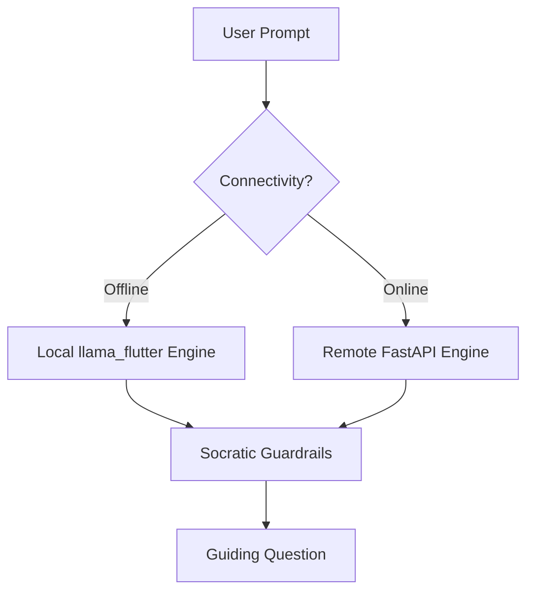
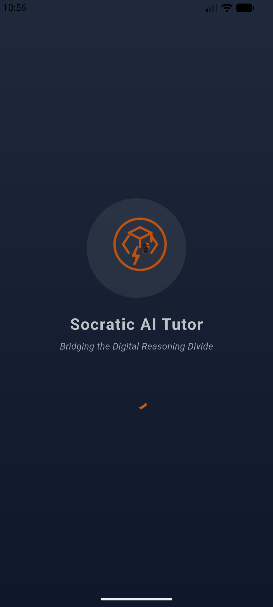
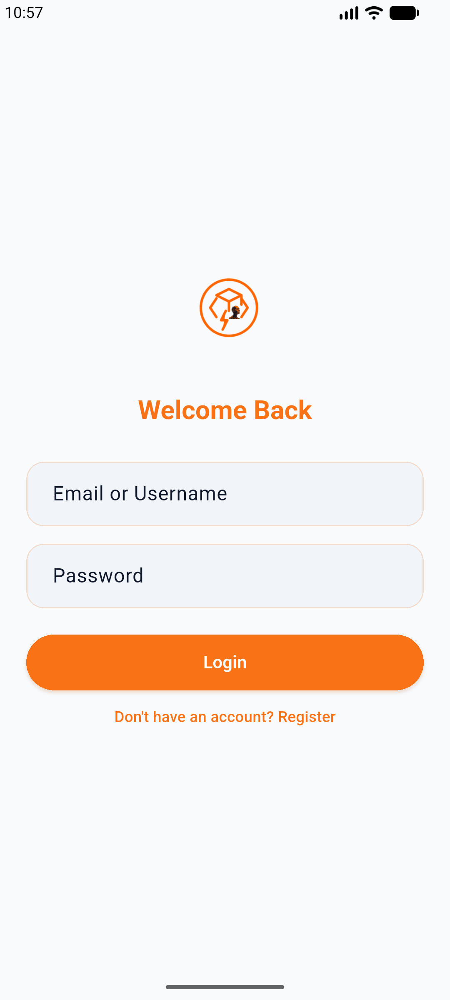
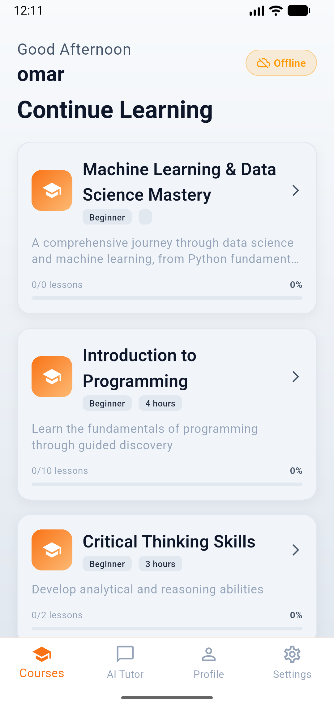
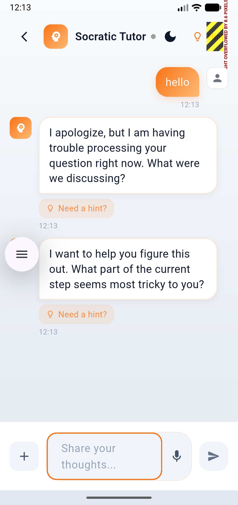
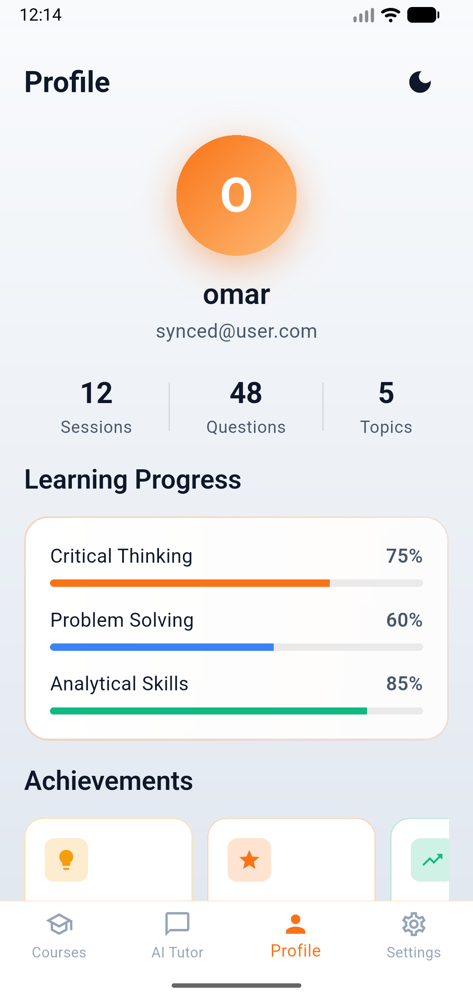
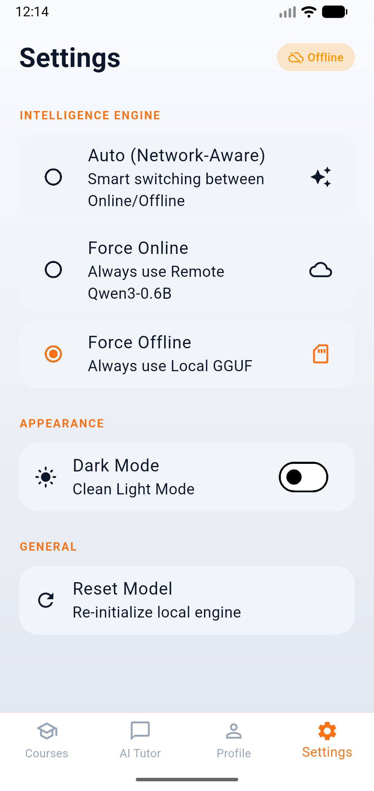

# Socratic AI Tutor: Hybrid Offline-First Personalized Learning

[](https://github.com/O-keita/socratic_ai_tutor.git)
[](https://flutter.dev)
[](https://fastapi.tiangolo.com)
[](https://opensource.org/licenses/MIT)

## 📝 Project Description
The **Socratic AI Tutor** is a self-contained, **hybrid offline-first** mobile application and backend system designed to revolutionize **Data Science and Machine Learning** education through the **Socratic Method**. Specifically tailored for technology learners in low-resource environments, this system acts as a guide rather than a source of direct answers, asking focused questions to help students discover complex ML concepts through their own reasoning.

By combining on-device LLM inference (GGUF) with a cloud-fallback API, it provides a seamless learning experience regardless of internet availability.

---

## 🔗 Project Resources
- **GitHub Repository**: [https://github.com/O-keita/socratic_ai_tutor.git](https://github.com/O-keita/socratic_ai_tutor.git)
- **Research Background**: Refer to our internal documentation on "Bridging the Digital Reasoning Divide in Africa".

---

## � Video Demo
Explore the Socratic AI Tutor in action! This video demonstrates the core functionalitiesz

**Socratic AI Tutor Video Demo** : [https://drive.google.com/file/d/19JzQTVYXiXWFX9ukc7zUP-SJ9GWhmDlB/view?usp=sharing](https://drive.google.com/file/d/19JzQTVYXiXWFX9ukc7zUP-SJ9GWhmDlB/view?usp=sharing)

*   **Duration**: ~8 Minutes

---

## 🎨 Designs & Architecture

### 🛠️ Logic & Architecture (System Diagram)
The following diagram represents the core logic flow (equivalent to a circuit diagram for this AI-driven system), showing how prompts are routed between local/remote engines and passed through pedagogical guardrails.



### 📱 App Interfaces (Screenshots)

| Splash Screen | Login | Register |
| :---: | :---: | :---: |
|  |  |  |

| Home (Courses) | AI Tutor | Chat |
| :---: | :---: | :---: |
|  |  |  |

| Profile | Settings |
| :---: | :---: |
|  |  |

---

## 🚀 Key Features

*   **🧠 Socratic Guardrails**: Strictly enforced pedagogical logic—the AI never gives direct answers and focuses on scaffolding knowledge.
*   **🔄 Hybrid Intelligence**: Intelligently switches between high-speed local inference (100% offline) and high-accuracy remote inference depending on connectivity and priority.
*   **📶 100% Offline Inference**: No internet required. Powered by quantized GGUF models running locally on ARM64 processors (Android/iOS).
*   **⚡ Hardware Accelerated**: Uses efficient native libraries (`llama_flutter_android`) for low-latency, on-device Socratic reasoning.
*   **📚 DS/ML Curriculum**: Integrated course library focused on **Data Science & Machine Learning** (Probability, Neural Networks, Feature Engineering) with metadata and lesson modules.
*   **💾 Local Persistence**: Sessions and progress are saved locally, allowing students to pick up where they left off.
*   **🎨 High-Contrast UI**: Refined "Modern Orange and Dark Blue" theme optimized for readability and accessibility in both Light and Dark modes.

### ☁️ Remote Server Deployment (Fallback Engine)

The system can optionally connect to a remote inference engine hosted on a **Virtual Private Server (VPS)** with 4GB+ RAM.

#### 1. Server Setup
```bash
# Clone the repository
git clone https://github.com/O-keita/socratic_ai_tutor.git
cd socratic_ai_tutor

# Ensure Docker & Docker Compose are installed
docker compose build
```

#### 2. Model Placement
Place the `socratic-q4_k_m.gguf` (~300MB) model in the root `models/` directory of the server. 

#### 3. Launch
```bash
docker compose up -d
```
The server will be available at your server's IP on port 8000.

---

## 🛠️ Tech Stack

### Frontend (Flutter)
- **State Management**: `Provider`
- **Native LLM Engine**: `llama_flutter_android` (C++ backend)
- **Hybrid Orchestration**: `HybridTutorService` for seamless cloud/edge switching.
- **Local Storage**: `SharedPreferences` & `PathProvider`
- **Networking**: `Dio` & `ConnectivityPlus` (for optional fallback to remote API)

### ML Layer
- **Base Model**: Qwen3-0.6B (Optimized for mobile inference)
- **Dataset**: ~37,000 Socratic dialogue turns training the model on pedagogical reasoning.
- **Quantization**: GGUF (Q4_K_M) for ~300MB footprint, optimized for offline mobile utilization on commodity hardware.
- **Tuning**: LoRA-based fine-tuning with integrated "Thought Chains" for teaching logic.

### Backend (Python/FastAPI)
- **Framework**: FastAPI
- **Inference**: `llama-cpp-python`
- **Metrics**: Adaptive performance tracking and log analysis.

---

## �️ Hybrid Architecture

The **Socratic AI Tutor** implements a specialized hybrid routing system:
1. **Edge-First**: The system primarily attempts local inference on-device using the bundled GGUF model for privacy and zero-latency.
2. **Cloud-Fallback**: If the device hardware is insufficient (e.g., x86 emulators or low-RAM devices) or if high-precision reasoning is required, the system seamlessly transitions to the FastAPI-based remote inference engine.
3. **Connectivity Aware**: Real-time monitoring via `ConnectivityPlus` ensures the best available engine is selected automatically.

---

## �📂 Project Structure

```text
socratic_ai_tutor/
├── backend/            # FastAPI server & evaluation logic
│   ├── core/           # Tutor system orchestrators
│   ├── ml/             # Inference engine & prompt templates
│   ├── data/           # Configs & instructional content
│   └── main.py         # Backend entry point
├── socratic_app/       # Flutter mobile application
│   ├── lib/            # Dart source code (UI/Services/Models)
│   ├── assets/         # Course content & bundled models
│   └── android/        # Native Android configurations
├── notebooks/          # Training and quantization research
│   ├── training/       # LoRA fine-tuning notebooks
│   └── quantization/   # GGUF conversion scripts
└── models/             # Local GGUF model files
```

---

## ⚙️ Environment Setup & Installation

### 1. Prerequisites
- **Flutter**: 3.19.0+ 
- **Python**: 3.10 or 3.11 (3.12 support depends on `llama-cpp-python` wheels)
- **Mobile Hardware**: Android device with ARM64 architecture (Local inference will not work on x86 emulators).
- **RAM**: 4GB+ RAM recommended for both backend and mobile device.

### 2. Backend Environment (FastAPI)
```bash
# Navigate to backend
cd backend

# Create and activate virtual environment
python -m venv .venv
source .venv/bin/activate  # On Windows: .venv\Scripts\activate

# Install dependencies with build tools (required for llama-cpp)
pip install --upgrade pip
pip install -r ../requirements.txt

# Run the server
python main.py
```

### 3. Mobile App Environment (Flutter)
```bash
# Navigate to app folder
cd socratic_app

# Install dependencies
flutter pub get

# Connect an ARM64 Android device
flutter run
```

### 4. GGUF Model Setup
Currently, the system is designed for small, quantized models (~300MB).
1. Download or export the `.gguf` model (e.g., `socratic-q4_k_m.gguf`).
2. Place a copy in `backend/models/` for server-side fallback.
3. For mobile, the app can be configured to load from `assets` or download on first run.

## 🚢 Deployment Plan

### ☁️ Remote Backend (Cloud Fallback)
The backend is optimized for deployment on Linux-based VPS or Cloud instances (AWS, Google Cloud, Azure).
- **Scale**: Containerized with Docker for easy orchestration.
- **Inference**: High-performance CPU/GPU inference via `llama-cpp-python`.
- **Connectivity**: Serves as a high-precision fallback for devices with limited local resources.
- **Orchestration**:
  ```bash
  docker compose up --build -d
  ```

### 📱 Mobile Application (Android/iOS)
1. **Model Hosting**: The 350MB GGUF engine model is hosted on a high-availability Model Hub (Hugging Face).
2. **Dynamic Onboarding**: Users are guided through a one-time "Local Intelligence" setup process to download the engine.
3. **Distribution**: 
   - **Android**: Release-ready APKs with split-ABI support (ARM64 priority).
   - **iOS**: Available via TestFlight with native Accelerate/Metal framework support for LLM speed.

---

## 📖 Socratic Guardrails
The application is strictly programmed to follow these pedagogical rules:
1. **No Direct Answers**: The AI identifies when it is being asked for a solution and pivots to a guiding question.
2. **Scaffolding**: Complex problems are broken down into smaller, manageable inquiries.
3. **Logic Verification**: The AI analyzes student reasoning to identify knowledge gaps and adapts dynamically.
4. **Visible Reasoning**: The model uses the Socratic method to lead students towards discovery rather than rote memorization.

---

## 👨‍💻 Project Submission Details (Capstone)
This repository contains the complete technical implementation for the Socratic AI Tutor Capstone.
- **Methodology**: Discovery Learning via Socratic Dialogue.
- **Innovation**: Hybrid Edge-Cloud LLM orchestration for low-resource environments.
- **Research focus**: Enhancing ML education through pedagogical AI guardrails.

## 📚 Content Library
The tutor's intelligence is supplemented by a structured curriculum centered on **Data Science and AI**:
- **Machine Learning**: Linear Regression, Clustering, Neural Networks, and Evaluation Metrics.
- **Data Science Foundations**: Statistics, Probability, Data Cleaning, and EDA.
- **Advanced AI**: NLP, Computer Vision, and Transformer Architectures.
- **Critical Computing**: Ethics in AI, Data Bias, and Algorithmic Reasoning.

---

## 🛠️ System Prompt Example
The AI's behavior is governed by a strict system prompt that ensures pedagogical integrity:
```text
You are a Socratic AI tutor specializing in data science and machine learning.

Your core teaching philosophy:
1. NEVER provide direct answers or explanations
2. ALWAYS respond with thoughtful guiding questions
3. Help learners discover answers through their own reasoning
4. Use questions that prompt reflection, analysis, and critical thinking

Response format:
- Begin with <think>...</think> to show your pedagogical reasoning
- Follow with a single, focused question that guides the learner
```

---

## 📝 License
Distributed under the MIT License. See `LICENSE` for more information.
