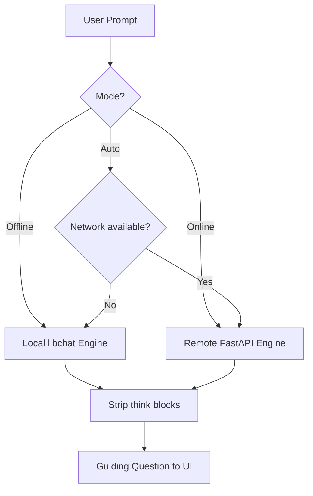

# Socratic AI Tutor: Hybrid Offline-First Personalized Learning

[](https://github.com/O-keita/socratic_ai_tutor.git)
[](https://flutter.dev)
[](https://fastapi.tiangolo.com)
[](https://opensource.org/licenses/MIT)

## Project Description
The **Socratic AI Tutor** is a **hybrid offline-first** mobile application and backend system designed to teach **Data Science and Machine Learning** through the **Socratic Method**. Tailored for technology learners in low-resource environments, the AI never gives direct answers — it asks focused guiding questions to help students discover concepts through their own reasoning.

By combining on-device LLM inference with a cloud-fallback API, it provides a seamless learning experience regardless of internet availability.

---

## Project Resources
- **GitHub Repository**: [https://github.com/O-keita/socratic_ai_tutor.git](https://github.com/O-keita/socratic_ai_tutor.git)
- **Video Demo** (~8 min): [Google Drive](https://drive.google.com/file/d/19JzQTVYXiXWFX9ukc7zUP-SJ9GWhmDlB/view?usp=sharing)

---

## Architecture

### Hybrid Edge-Cloud Routing

The system implements a specialized hybrid routing layer (`HybridTutorService`) that selects the best inference engine automatically:


```mermaid
graph TD
    A[User Prompt] --> B{Mode?}
    B -- Offline --> C[Local libchat Engine]
    B -- Online --> D[Remote FastAPI Engine]
    B -- Auto --> E{Network available?}
    E -- Yes --> D
    E -- No --> C
    C --> F[Strip think blocks]
    D --> F
    F --> G[Guiding Question to UI]
```

1. **Edge-First**: Attempts local inference on-device using the GGUF model for privacy and zero-latency.
2. **Cloud-Fallback**: If the device is offline-incapable (x86 emulator, low RAM, previous crash) or online mode is selected, routes to the FastAPI backend.
3. **Crash-Loop Protection**: SharedPreferences flags detect OOM/SIGILL crashes and automatically block local inference on next launch, routing to remote instead.

### On-Device Inference: libchat C API

Instead of third-party Flutter packages (which have broken builds, missing submodules, or wrong CPU targets), we built a custom thin C wrapper (`libchat`) around llama.cpp that compiles from source into the APK via CMake:

```
Flutter (Dart) --> dart:ffi --> libchat.so --> llama.cpp (compiled from source)
```

**Why not existing packages?**
- `llama_cpp_dart` — pub.dev strips git submodules, ships without llama.cpp source
- `llamadart` — pre-built binaries use ARMv8.2+dotprod, crash with SIGILL on older ARM64 CPUs
- `llama_flutter_android` — crashes during inference

**libchat API (4 functions):**
```c
chat_session * chat_create(const char * model_path, int n_ctx, int n_threads);
char * chat_generate(chat_session * session, const char * user_message);
void chat_string_free(char * str);
void chat_destroy(chat_session * session);
```

Key features:
- Chat template auto-detected from GGUF metadata (ChatML, Qwen, Llama, etc.)
- Conversation history managed natively inside the C session struct
- CPU-only ARM64 baseline — runs on every ARM64 device
- Inference runs in `Isolate.run()` to keep Flutter UI responsive

Full documentation: [`socratic_app/android/app/src/main/cpp/LIBCHAT.md`](socratic_app/android/app/src/main/cpp/LIBCHAT.md)

---

## App Interfaces

| Splash Screen | Login | Register |
| :---: | :---: | :---: |
|  |  |  |

| Home (Courses) | AI Tutor | Chat |
| :---: | :---: | :---: |
|  |  |  |

| Profile | Settings |
| :---: | :---: |
|  |  |

---

## Key Features

- **Socratic Guardrails**: The AI never gives direct answers — responds only with guiding questions to scaffold knowledge discovery.
- **Hybrid Intelligence**: Seamless switching between local inference (100% offline) and remote inference based on connectivity.
- **100% Offline Inference**: Quantized GGUF models run locally on ARM64 Android devices via our custom `libchat` C API.
- **`<think>` Block Reasoning**: The model generates internal reasoning in `<think>...</think>` blocks (stripped before display) to improve response quality.
- **DS/ML Curriculum**: Integrated course library covering Probability, Neural Networks, Feature Engineering, and more.
- **Python Playground**: In-app Python editor powered by Pyodide (WebAssembly) for hands-on coding.
- **Local Persistence**: Sessions and progress saved locally via SharedPreferences.
- **High-Contrast UI**: "Modern Orange and Dark Blue" theme optimized for readability in both Light and Dark modes.

---

## Tech Stack

### Frontend (Flutter)
- **State Management**: `Provider`
- **On-Device Inference**: Custom `libchat` C API (llama.cpp compiled from source via CMake)
- **Dart FFI**: `dart:ffi` bindings to `libchat.so` — no third-party inference packages
- **Hybrid Orchestration**: `HybridTutorService` for seamless cloud/edge switching
- **Local Storage**: `SharedPreferences` & `PathProvider`
- **Networking**: `Dio` (model download with resume) & `ConnectivityPlus`

### ML Layer
- **Base Model**: Qwen3-0.6B (fine-tuned for Socratic tutoring)
- **Training Data**: ~307 conversations (234 Socratic + 73 supplementary: code, greetings, diverse topics), augmented to ~991 samples via conversation windowing
- **Fine-Tuning**: LoRA (r=32, RSLoRA) targeting all attention + MLP projections, 4 epochs
- **Quantization**: GGUF Q4_K_M (~460 MB) for mobile deployment
- **Three Modes**: Socratic questioning, code guidance, casual conversation — model auto-detects intent
- **Think Blocks**: Model trained to always generate `<think>...</think>` reasoning (stripped before UI display)

### Backend (Python/FastAPI)
- **Framework**: FastAPI
- **Inference**: `llama-cpp-python`
- **Admin Panel**: Web-based course management at `/admin`
- **Metrics**: Adaptive performance tracking and session analysis

### Web App (React)
- **Stack**: React 18 + TypeScript + Vite + Tailwind CSS
- **Features**: Student portal + admin dashboard
- **Auth**: JWT-based, syncs progress with backend

---

## Project Structure

```text
socratic_ai_tutor/
├── backend/                  # FastAPI server
│   ├── main.py               # All routes (auth, chat, content, admin)
│   ├── core/                 # Auth & admin session management
│   ├── ml/                   # Inference engine & prompt templates
│   ├── evaluation/           # Adaptive metrics & session analysis
│   ├── data/                 # Config & user database
│   └── content/              # Admin-uploaded courses (runtime)
├── socratic_app/             # Flutter mobile app
│   ├── android/app/src/main/cpp/
│   │   ├── libchat.h         # C API header (4 functions)
│   │   ├── libchat.cc        # Implementation (~235 lines)
│   │   ├── CMakeLists.txt    # Builds llama.cpp from source
│   │   └── LIBCHAT.md        # Full C API documentation
│   ├── lib/
│   │   ├── screens/          # UI screens
│   │   ├── services/         # Business logic & inference
│   │   ├── models/           # Data classes
│   │   ├── widgets/          # Reusable components
│   │   └── theme/            # App theme
│   └── assets/               # Courses, quizzes, glossary, playground
├── webapp/                   # React web app (admin + student portal)
├── notebooks/training/       # Fine-tuning notebooks (Colab)
├── models/                   # GGUF model files (not in git)
├── docker-compose.yml
└── requirements.txt
```

---

## Environment Setup & Installation

### Prerequisites
- **Flutter**: 3.19.0+
- **Python**: 3.10 or 3.11
- **Mobile Hardware**: Android device with ARM64 architecture
- **RAM**: 4GB+ recommended for both backend and mobile device

### 1. Backend (FastAPI)
```bash
cd backend
python -m venv .venv
source .venv/bin/activate
pip install -r ../requirements.txt

# Place the GGUF model in models/
uvicorn main:app --reload --host 0.0.0.0 --port 8000
```

Or via Docker:
```bash
docker compose up --build -d
```

### 2. Mobile App (Flutter)
```bash
cd socratic_app
flutter pub get
flutter run                   # Debug mode on connected device
flutter build apk --release   # Release APK (~60 MB)
```

### 3. Model Setup
The app downloads the GGUF model (~460 MB) from HuggingFace on first run:
- **Model Setup Screen** guides the user through the download
- Supports **resume** — interrupted downloads continue from where they left off
- Model is stored in `getApplicationSupportDirectory()` (app-private storage)

For the backend, place the model at `models/socratic-q4_k_m.gguf`.

### 4. Web App
```bash
cd webapp
npm install
npm run dev      # Dev server at http://localhost:5173
npm run build    # Production build → dist/
```

---

## System Prompt

The model is fine-tuned with a unified system prompt that handles three behavioral modes:

```text
You are a Socratic AI tutor specializing in data science and machine learning.

RULES:
1. ALWAYS begin your response with a thinking block containing your reasoning.
2. For conceptual questions: respond with ONE guiding question. NEVER give direct
   answers. If the student is stuck, give a small hint before your question.
3. For code questions: guide the student to write the code themselves through
   Socratic questioning.
4. For casual messages (greetings, thanks, chitchat): respond warmly and naturally.

Always start with a thinking block. This is mandatory.
```

---

## Socratic Guardrails

1. **No Direct Answers**: The AI identifies solution requests and pivots to guiding questions.
2. **Scaffolding**: Complex problems are broken into smaller, manageable inquiries.
3. **Three-Mode Behavior**: Conceptual questions get Socratic guidance, code questions get implementation guidance, casual messages get warm responses.
4. **Think-Then-Respond**: The model reasons internally in `<think>` blocks before responding, improving pedagogical quality (reasoning is stripped from the UI).

---

## Content Library

The tutor's curriculum covers:
- **Machine Learning**: Linear Regression, Clustering, Neural Networks, Evaluation Metrics
- **Data Science Foundations**: Statistics, Probability, Data Cleaning, EDA
- **Programming**: Python fundamentals, data structures, algorithms
- **Critical Thinking**: Logic, reasoning, cognitive biases

Courses are bundled in the APK for offline use. Admins can upload additional courses through the web panel at `/admin`.

---

## Deployment

### Remote Backend
```bash
docker compose up --build -d
# Server available at port 8000
# Admin panel: http://your-server:8000/admin
# API docs: http://your-server:8000/docs
```

### Android APK
```bash
cd socratic_app && flutter build apk --release
# Output: build/app/outputs/flutter-apk/app-release.apk (~60 MB)
# Model downloaded separately on first launch (~460 MB)
```

---

## Capstone Submission Details
- **Methodology**: Discovery Learning via Socratic Dialogue
- **Innovation**: Custom C API (`libchat`) for reliable on-device LLM inference, hybrid edge-cloud routing for low-resource environments
- **Research Focus**: Enhancing ML education through pedagogical AI guardrails

---

## License
Distributed under the MIT License. See `LICENSE` for more information.
