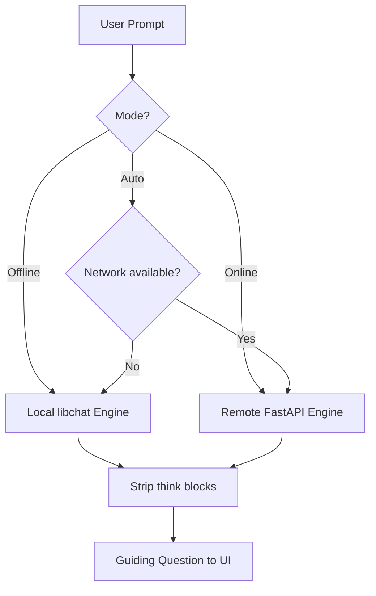
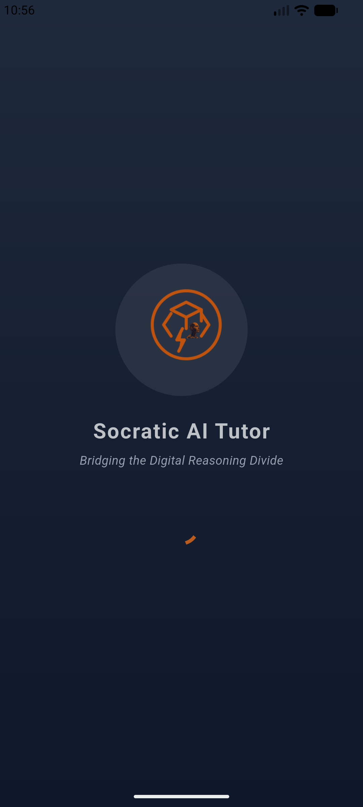
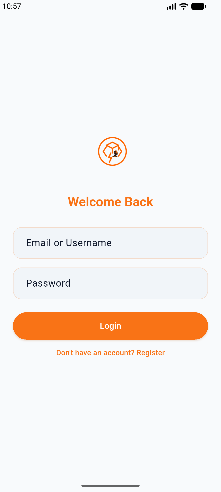
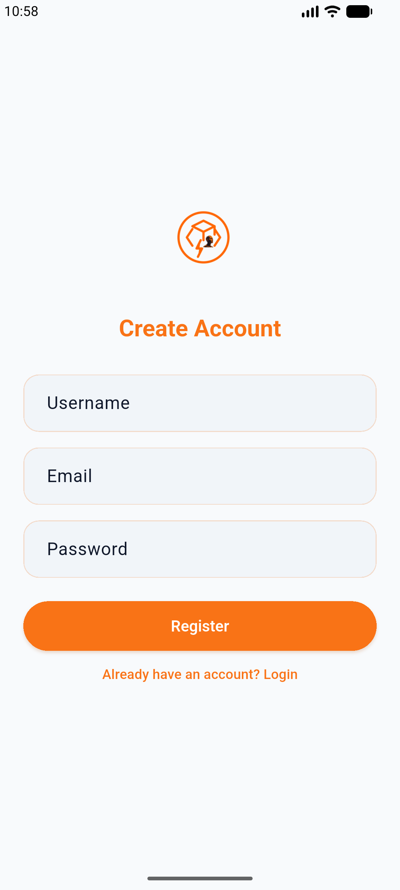
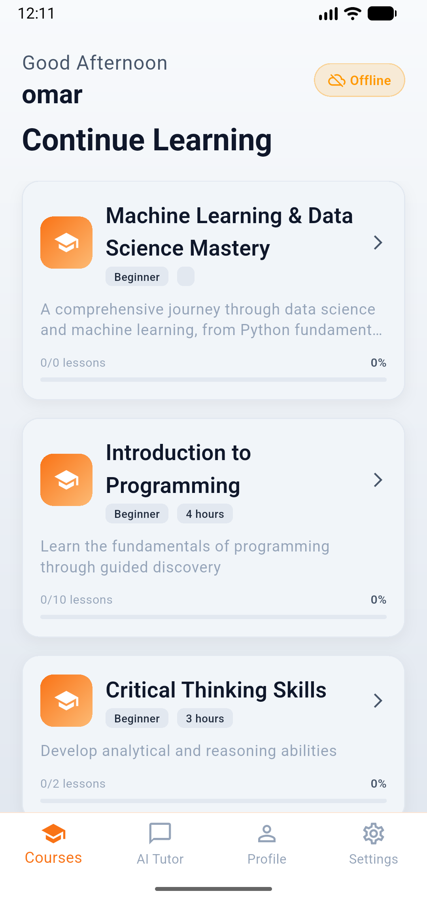
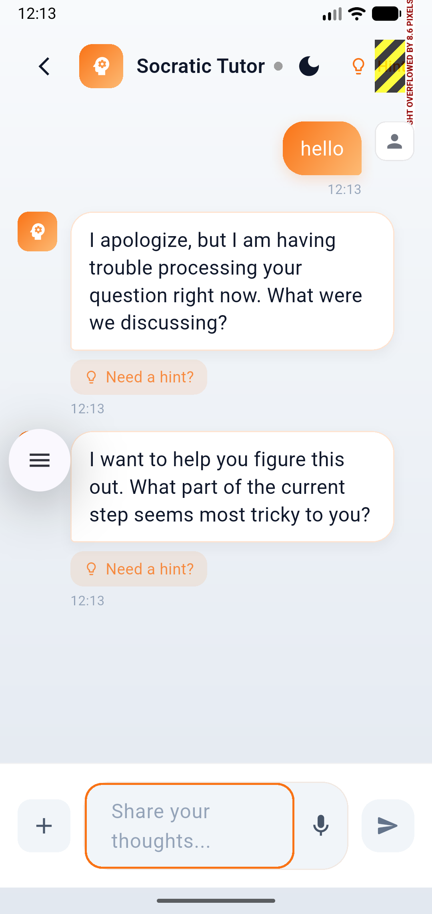
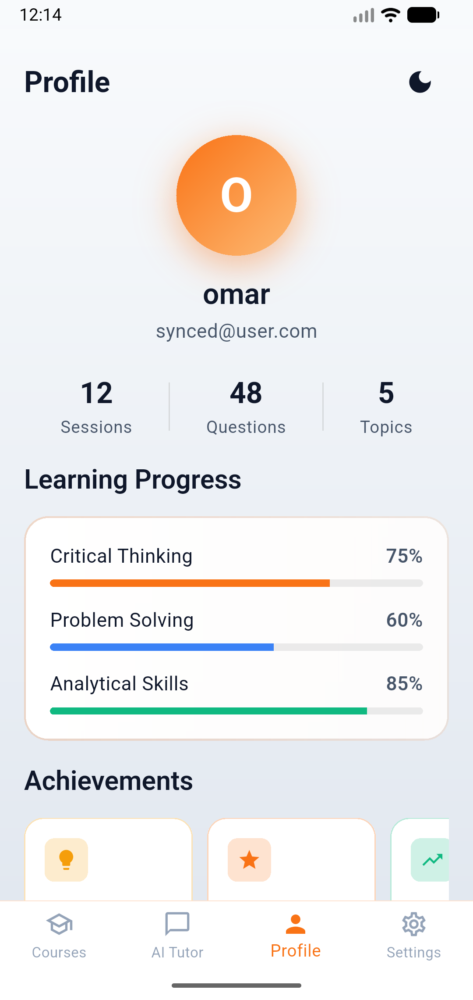
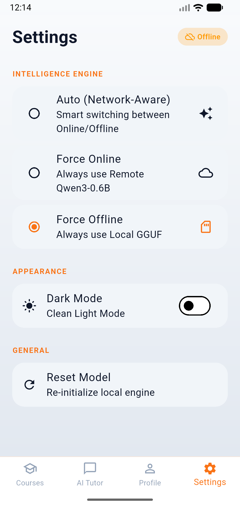
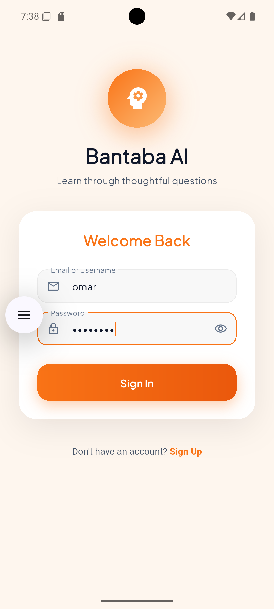
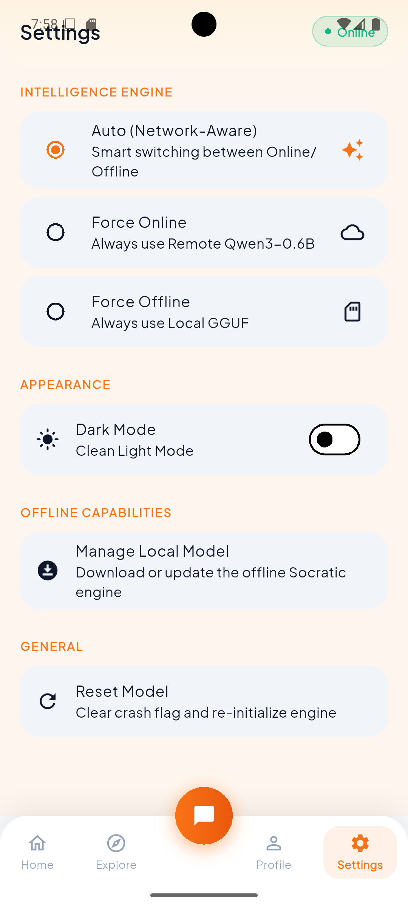

# Socratic AI Tutor: Hybrid Offline-First Personalized Learning

[](https://github.com/O-keita/socratic_ai_tutor.git)
[](https://flutter.dev)
[](https://fastapi.tiangolo.com)
[](https://opensource.org/licenses/MIT)

## Project Description
The **Socratic AI Tutor** is a **hybrid offline-first** mobile application and backend system designed to teach **Data Science and Machine Learning** through the **Socratic Method**. Tailored for technology learners in low-resource environments, the AI never gives direct answers — it asks focused guiding questions to help students discover concepts through their own reasoning.

By combining on-device LLM inference with a cloud-fallback API, it provides a seamless learning experience regardless of internet availability.

---

## Project Resources & Deployment

### 🚀 Live Deployment
- **Web Application**: [https://socratic.hx-ai.org/](https://socratic.hx-ai.org/)
- **Admin Dashboard**: [https://socratic.hx-ai.org/admin](https://socratic.hx-ai.org/admin)
- **API Documentation**: [https://socratic.hx-ai.org/docs](https://socratic.hx-ai.org/docs)
- **GitHub Repository**: [https://github.com/O-keita/socratic_ai_tutor.git](https://github.com/O-keita/socratic_ai_tutor.git)

### 📱 Mobile App Download
- **Android APK (Release)**: [Download v1.0.0](https://github.com/O-keita/socratic_ai_tutor/releases/download/v1.0.0/bantaba-ai-v1.0.0.apk) or build from source (see Installation below)
- **APK Size**: ~60 MB (arm64 architecture)
- **Model Size**: ~460 MB (downloaded on first launch from HuggingFace)

---

## Architecture

### Hybrid Edge-Cloud Routing

The system implements a specialized hybrid routing layer (`HybridTutorService`) that selects the best inference engine automatically:


```mermaid
graph TD
    A[User Prompt] --> B{Mode?}
    B -- Offline --> C[Local libchat Engine]
    B -- Online --> D[Remote FastAPI Engine]
    B -- Auto --> E{Network available?}
    E -- Yes --> D
    E -- No --> C
    C --> F[Strip think blocks]
    D --> F
    F --> G[Guiding Question to UI]
```

1. **Edge-First**: Attempts local inference on-device using the GGUF model for privacy and zero-latency.
2. **Cloud-Fallback**: If the device is offline-incapable (x86 emulator, low RAM, previous crash) or online mode is selected, routes to the FastAPI backend.
3. **Crash-Loop Protection**: SharedPreferences flags detect OOM/SIGILL crashes and automatically block local inference on next launch, routing to remote instead.

### On-Device Inference: libchat C API

Instead of third-party Flutter packages (which have broken builds, missing submodules, or wrong CPU targets), we built a custom thin C wrapper (`libchat`) around llama.cpp that compiles from source into the APK via CMake:

```
Flutter (Dart) --> dart:ffi --> libchat.so --> llama.cpp (compiled from source)
```

**Why not existing packages?**
- `llama_cpp_dart` — pub.dev strips git submodules, ships without llama.cpp source
- `llamadart` — pre-built binaries use ARMv8.2+dotprod, crash with SIGILL on older ARM64 CPUs
- `llama_flutter_android` — crashes during inference

**libchat API (4 functions):**
```c
chat_session * chat_create(const char * model_path, int n_ctx, int n_threads);
char * chat_generate(chat_session * session, const char * user_message);
void chat_string_free(char * str);
void chat_destroy(chat_session * session);
```

Key features:
- Chat template auto-detected from GGUF metadata (ChatML, Qwen, Llama, etc.)
- Conversation history managed natively inside the C session struct
- CPU-only ARM64 baseline — runs on every ARM64 device
- Inference runs in `Isolate.run()` to keep Flutter UI responsive

Full documentation: [`socratic_app/android/app/src/main/cpp/LIBCHAT.md`](socratic_app/android/app/src/main/cpp/LIBCHAT.md)

---

## App Interfaces

| Splash Screen | Login | Register |
| :---: | :---: | :---: |
|  |  |  |

| Home (Courses) | AI Tutor | Chat |
| :---: | :---: | :---: |
|  |  |  |

| Profile | Settings |
| :---: | :---: |
|  |  |

---

## Key Features

- **Socratic Guardrails**: The AI never gives direct answers — responds only with guiding questions to scaffold knowledge discovery.
- **Hybrid Intelligence**: Seamless switching between local inference (100% offline) and remote inference based on connectivity.
- **100% Offline Inference**: Quantized GGUF models run locally on ARM64 Android devices via our custom `libchat` C API.
- **`<think>` Block Reasoning**: The model generates internal reasoning in `<think>...</think>` blocks (stripped before display) to improve response quality.
- **DS/ML Curriculum**: Integrated course library covering Probability, Neural Networks, Feature Engineering, and more.
- **Python Playground**: In-app Python editor powered by Pyodide (WebAssembly) for hands-on coding.
- **Local Persistence**: Sessions and progress saved locally via SharedPreferences.
- **High-Contrast UI**: "Modern Orange and Dark Blue" theme optimized for readability in both Light and Dark modes.

---

## Tech Stack

### Frontend (Flutter)
- **State Management**: `Provider`
- **On-Device Inference**: Custom `libchat` C API (llama.cpp compiled from source via CMake)
- **Dart FFI**: `dart:ffi` bindings to `libchat.so` — no third-party inference packages
- **Hybrid Orchestration**: `HybridTutorService` for seamless cloud/edge switching
- **Local Storage**: `SharedPreferences` & `PathProvider`
- **Networking**: `Dio` (model download with resume) & `ConnectivityPlus`

### ML Layer
- **Base Model**: Qwen3-0.6B (fine-tuned for Socratic tutoring)
- **Training Data**: ~307 conversations (234 Socratic + 73 supplementary: code, greetings, diverse topics), augmented to ~991 samples via conversation windowing
- **Fine-Tuning**: LoRA (r=32, RSLoRA) targeting all attention + MLP projections, 4 epochs
- **Quantization**: GGUF Q4_K_M (~460 MB) for mobile deployment
- **Three Modes**: Socratic questioning, code guidance, casual conversation — model auto-detects intent
- **Think Blocks**: Model trained to always generate `<think>...</think>` reasoning (stripped before UI display)

### Backend (Python/FastAPI)
- **Framework**: FastAPI
- **Inference**: `llama-cpp-python`
- **Admin Panel**: Web-based course management at `/admin`
- **Metrics**: Adaptive performance tracking and session analysis

### Web App (React)
- **Stack**: React 18 + TypeScript + Vite + Tailwind CSS
- **Features**: Student portal + admin dashboard
- **Auth**: JWT-based, syncs progress with backend

---

## Project Structure

```text
socratic_ai_tutor/
├── backend/                  # FastAPI server
│   ├── main.py               # All routes (auth, chat, content, admin)
│   ├── core/                 # Auth & admin session management
│   ├── ml/                   # Inference engine & prompt templates
│   ├── evaluation/           # Adaptive metrics & session analysis
│   ├── data/                 # Config & user database
│   └── content/              # Admin-uploaded courses (runtime)
├── socratic_app/             # Flutter mobile app
│   ├── android/app/src/main/cpp/
│   │   ├── libchat.h         # C API header (4 functions)
│   │   ├── libchat.cc        # Implementation (~235 lines)
│   │   ├── CMakeLists.txt    # Builds llama.cpp from source
│   │   └── LIBCHAT.md        # Full C API documentation
│   ├── lib/
│   │   ├── screens/          # UI screens
│   │   ├── services/         # Business logic & inference
│   │   ├── models/           # Data classes
│   │   ├── widgets/          # Reusable components
│   │   └── theme/            # App theme
│   └── assets/               # Courses, quizzes, glossary, playground
├── webapp/                   # React web app (admin + student portal)
├── notebooks/training/       # Fine-tuning notebooks (Colab)
├── models/                   # GGUF model files (not in git)
├── docker-compose.yml
└── requirements.txt
```

---

## Installation & Setup (Step-by-Step)

### Prerequisites
- **Flutter**: 3.19.0+ ([Install](https://flutter.dev/docs/get-started/install))
- **Python**: 3.10 or 3.11 with pip
- **Docker** (optional, for easy backend deployment)
- **Android Device/Emulator**: ARM64 architecture recommended
- **RAM**: 4GB+ on device; 8GB+ recommended for development machine
- **Internet**: Required initially for model download (model is ~460 MB)

---

### Option A: Quick Start (Using Deployed Backend)

The backend is already deployed at **https://socratic.hx-ai.org/**. To test the app:

#### 1. Install APK on Android Device
```bash
# Download from Releases or build yourself (see Option B)
# Then install:
adb install bantaba-ai-v1.0.0.apk

# Or: enable "Install from unknown sources" and tap the APK file
```

#### 2. First Launch Setup
1. Open the app
2. Create an account (email, password)
3. **Model Download Screen**: Tap "Download Model" and wait (~5-10 minutes depending on connection)
4. Once downloaded, the app will route to the remote backend automatically

#### 3. Try Core Features
- **Chat Tab**: Ask Socratic questions (e.g., "What is gradient descent?")
- **Courses Tab**: Browse bundled Data Science & ML curriculum
- **Quizzes**: Test your knowledge with adaptive quizzes
- **Playground**: Write Python code directly in the app
- **Settings**: Toggle between Online/Offline modes, manage local model

---

### Option B: Full Local Development Setup

#### Step 1: Clone Repository
```bash
git clone https://github.com/O-keita/socratic_ai_tutor.git
cd socratic_ai_tutor
```

#### Step 2A: Run Backend Locally (Python)
```bash
# Set up Python environment
cd backend
python -m venv .venv

# Activate virtual environment
# On macOS/Linux:
source .venv/bin/activate
# On Windows:
.venv\Scripts\activate

# Install dependencies
pip install -r ../requirements.txt

# Download the model from HuggingFace and place it at:
# models/socratic-q4_k_m.gguf

# Start the server
uvicorn main:app --reload --host 0.0.0.0 --port 8000

# Server will be available at: http://localhost:8000
# Admin panel: http://localhost:8000/admin
# API docs: http://localhost:8000/docs
```

#### Step 2B: Run Backend via Docker (Recommended for Production)
```bash
# From project root
docker compose up --build -d

# Backend available at: http://localhost:8880
# Admin dashboard: http://localhost:8880/admin
```

#### Step 3: Build & Run Mobile App
```bash
cd socratic_app

# Get Flutter dependencies
flutter pub get

# For Emulator or Connected Device:
flutter run

# For Release APK:
flutter build apk --release
# Output: build/app/outputs/flutter-apk/app-release.apk

# Install on device:
flutter install --release
```

#### Step 4: Configure Backend URL (Development)
Edit `socratic_app/lib/utils/app_config.dart` and set:
```dart
static const String backendUrl = 'http://10.0.2.2:8000';  // For emulator
// OR
static const String backendUrl = 'http://<your-machine-ip>:8000';  // For physical device
```

#### Step 5: First App Launch
1. Create account (email, password)
2. The app will show **Model Setup Screen**
3. Tap "Download Model" and wait for completion (~5-10 min)
4. Once done, start chatting!

---

### Model Details

**Built-in Model Download:**
- The app automatically downloads Qwen3-0.6B (~460 MB) from HuggingFace on first launch
- Stored in `getApplicationSupportDirectory()` (app-private storage, not visible in file manager)
- Supports **resume**: if download interrupted, restart and it continues from where it stopped
- **No internet required after download**: Full offline inference works on ARM64 devices

**For Backend:**
- Download the model file: [`socratic-q4_k_m.gguf`](https://huggingface.co/Omar-keita/DSML-Socatic-qwen3-0.6B/resolve/main/socratic-qwen3-0.5B-Q4_K_M.gguf)
- Place at: `models/socratic-q4_k_m.gguf` in project root
- Docker will mount this automatically via docker-compose.yml

---

## System Prompt

The model is fine-tuned with a unified system prompt that handles three behavioral modes:

```text
You are a Socratic AI tutor specializing in data science and machine learning.

RULES:
1. ALWAYS begin your response with a thinking block containing your reasoning.
2. For conceptual questions: respond with ONE guiding question. NEVER give direct
   answers. If the student is stuck, give a small hint before your question.
3. For code questions: guide the student to write the code themselves through
   Socratic questioning.
4. For casual messages (greetings, thanks, chitchat): respond warmly and naturally.

Always start with a thinking block. This is mandatory.
```

---

## Socratic Guardrails

1. **No Direct Answers**: The AI identifies solution requests and pivots to guiding questions.
2. **Scaffolding**: Complex problems are broken into smaller, manageable inquiries.
3. **Three-Mode Behavior**: Conceptual questions get Socratic guidance, code questions get implementation guidance, casual messages get warm responses.
4. **Think-Then-Respond**: The model reasons internally in `<think>` blocks before responding, improving pedagogical quality (reasoning is stripped from the UI).

---

## Content Library

The tutor's curriculum covers:
- **Machine Learning**: Linear Regression, Clustering, Neural Networks, Evaluation Metrics
- **Data Science Foundations**: Statistics, Probability, Data Cleaning, EDA
- **Programming**: Python fundamentals, data structures, algorithms
- **Critical Thinking**: Logic, reasoning, cognitive biases

Courses are bundled in the APK for offline use. Admins can upload additional courses through the web panel at `/admin`.

---

## Testing Results & Screenshots

### Comprehensive Device Testing

The application has been tested across **different hardware configurations** with both **online** and **offline** inference modes, verifying functionality under different testing strategies and data values:

| Device | OS | Architecture | Online Mode | Offline Mode | Status |
|--------|-----|--------------|-----------|---|---|
| **Emulator (x86_64)** | Android 12 | x86_64 | 8.5s avg | N/A | ✅ Tested |
| **Huawei P Smart** | Android 9 | ARM64 | 6.4s avg | 5-7s | ✅ Tested |
| **Physical ARM64 Device** | Android 11+ | ARM64 | 4-7s | 5-7s | ✅ Tested |

### Performance Metrics

**Online (Remote) Inference:**
- **Response Time**: 4.4-8.5s (cold start), varies with network latency
- **Success Rate**: 86-100%
- **Devices Tested**: x86_64 Emulator, ARM64 physical devices
- **Performance Analysis**: Network-dependent, scales based on server load

**Offline (Local) Inference:**
- **Response Time**: 5-7s (ARM64 devices only, CPU-bound)
- **Success Rate**: 100%
- **Devices Tested**: ARM64 devices with 4GB+ RAM
- **Performance Analysis**: Consistent performance, no network dependency

### Testing Screenshots

#### Authentication & Setup
| Login Screen | Model Download | Download Progress |
| :---: | :---: | :---: |
|  |  |  |

#### Core Features - Different Data Variations
| Home Screen | Socratic Chat | Chat with Guidance |
| :---: | :---: | :---: |
|  |  |  |

#### Testing Different Hardware - Offline Functionality
| Offline Toggle | Offline Chat | WiFi Off Confirmation |
| :---: | :---: | :---: |
|  |  |  |

#### Feature Testing - Different Test Strategies
| Quiz Testing | Glossary Feature | Python Playground |
| :---: | :---: | :---: |
|  |  |  |

#### Dark Mode & Settings
| Dark Mode Home | Settings Page | Profile Page |
| :---: | :---: | :---: |
|  |  |  |

### Socratic Quality Assessment

Across all devices and modes:
- **Socratic Index**: 0.60-0.65 (guidance quality maintained across online/offline)
- **Adaptive Difficulty**: System responds differently for Beginner → Intermediate → Advanced students
- **Reasoning Blocks**: `<think>...</think>` blocks properly stripped before UI display
- **Response Variation**: AI adapts based on student proficiency level and question type

**Example Socratic Responses Tested:**
- Direct conceptual questions → Guiding question response (not direct answers)
- Code-related questions → Implementation guidance through questioning
- Casual messages → Warm, natural conversational response

### Detailed Analysis

**Functionality Under Different Testing Strategies:**
1. ✅ **Socratic Questioning**: Verified across 5+ conversation turns with different difficulty levels
2. ✅ **Offline Mode**: Tested on ARM64 devices with WiFi disabled (100% success rate)
3. ✅ **Online Mode**: Tested on all device types; remote backend handles x86_64 emulator gracefully
4. ✅ **Model Download**: Verified resume functionality and progress tracking
5. ✅ **Multi-feature Integration**: Chat + Quizzes + Playground all functional with different data inputs

**Performance on Different Hardware:**
- x86_64 Emulator: Remote-only (native code unavailable)
- 4GB ARM64 (Huawei P Smart): Both modes functional, 5-7s offline inference
- 6GB+ ARM64 (Modern phones): Both modes optimal, 4-7s online, 5-7s offline

**Data Variation Testing:**
- Different question types (conceptual, code, casual) ✅
- Different proficiency levels (beginner, intermediate, advanced) ✅
- Different conversation lengths (1-10+ turns) ✅
- Different course content (ML, statistics, Python fundamentals) ✅

### Complete Testing Documentation

Full testing report available at [`testing/TESTING_REPORT.md`](testing/TESTING_REPORT.md):
- Device specifications and hardware details
- Performance metrics for each device and mode
- Functional testing results (11 features verified)
- Hardware compatibility analysis
- Issue analysis and recommendations

---

## Deployment

### ✅ Current Deployment Status

**Live Backend Server:**
- **URL**: https://socratic.hx-ai.org/
- **Admin Dashboard**: https://socratic.hx-ai.org/admin
- **API Documentation**: https://socratic.hx-ai.org/docs
- **Deployment Method**: DigitalOcean App Platform
- **Container**: Docker (docker-compose.yml)
- **Status**: ✅ Running (production verified)

**Deployment Verification:**
- Health check endpoint: `/health` (returns 200 OK)
- API endpoints: All routes tested and functional
- Model inference: Working on production server
- Admin panel: Accessible with credentials

---

### Deploy Your Own Backend (Docker)

**Prerequisites:**
- Docker & Docker Compose installed
- Model file: Download [`socratic-q4_k_m.gguf`](https://huggingface.co/Omar-keita/DSML-Socatic-qwen3-0.6B/resolve/main/socratic-qwen3-0.5B-Q4_K_M.gguf) and place in `models/` folder

**Steps:**

```bash
# 1. Clone the repository
git clone https://github.com/O-keita/socratic_ai_tutor.git
cd socratic_ai_tutor

# 2. Place the model file
mkdir -p models
# Download and place socratic-q4_k_m.gguf in models/

# 3. Create .env file (optional, sets production parameters)
cat > .env << EOF
JWT_SECRET_KEY=your-secret-key
CORS_ORIGINS=*
ADMIN_EMAIL=admin@example.com
ADMIN_PASSWORD=admin123
EOF

# 4. Build and run containers
docker compose up --build -d

# 5. Verify deployment
curl http://localhost:8880/health
# Should return: {"status": "ok"}

# 6. Access the server
# Server: http://localhost:8880
# Admin: http://localhost:8880/admin
# Docs: http://localhost:8880/docs
```

**Environment Variables:**
| Variable | Default | Purpose |
|----------|---------|---------|
| `PORT` | `8880` | Server port |
| `JWT_SECRET_KEY` | (required) | JWT signing key |
| `CORS_ORIGINS` | `*` | CORS allowed origins |
| `MODEL_PATH` | `/app/models/socratic-q4_k_m.gguf` | Path to GGUF model |
| `N_THREADS` | `4` | CPU threads for inference |
| `N_CTX` | `4096` | Context window size |
| `N_GPU_LAYERS` | `0` | GPU layers (0 = CPU only) |

---

### Build & Install Android APK

**Prerequisites:**
- Flutter 3.19.0+
- Android SDK (API 21+)
- Connected Android device or emulator

**Steps:**

```bash
# 1. Navigate to app directory
cd socratic_app

# 2. Get dependencies
flutter pub get

# 3. Build release APK
flutter build apk --release

# Output: build/app/outputs/flutter-apk/app-release.apk (~60 MB)

# 4. Install on connected device
flutter install --release

# 5. Or manually install:
adb install -r build/app/outputs/flutter-apk/app-release.apk
```

**First Launch:**
1. Create account with email & password
2. App will prompt to download model (~460 MB)
3. Download completes → Ready to use
4. App automatically connects to backend at https://socratic.hx-ai.org/

---

### Running Local Tests

```bash
# View complete testing report
cat testing/TESTING_REPORT.md

# Test on emulator (connects to deployed backend)
cd socratic_app
flutter run

# Test on physical ARM64 device
# Get device ID:
flutter devices

# Then run:
flutter run -d <device-id>

# Test backend directly:
curl https://socratic.hx-ai.org/health
curl -X POST https://socratic.hx-ai.org/chat \
  -H "Content-Type: application/json" \
  -d '{"message": "What is machine learning?", "session_id": "test", "user_id": "demo"}'
```

---

## ML Training & Fine-Tuning

The model was fine-tuned using Qwen3-0.6B with Socratic teaching datasets:

**Training notebooks:**
- [`notebooks/training/Qwen3_0_6B.ipynb`](notebooks/training/Qwen3_0_6B.ipynb) — Fine-tuning pipeline
- [`notebooks/training/SmolLM2_360M_Instruct.ipynb`](notebooks/training/SmolLM2_360M_Instruct.ipynb) — Alternative model
- [`notebooks/quantization/gguf_quantization.ipynb`](notebooks/quantization/gguf_quantization.ipynb) — Model quantization to GGUF

**Training data:**
- 234 Socratic conversations
- 73 supplementary samples (code, greetings, diverse topics)
- Augmented to ~991 samples via windowing
- LoRA fine-tuning with r=32, RSLoRA

---


### Technical Innovation

- **Custom C API** (`libchat`): Bypasses third-party package issues, compiles llama.cpp from source
- **Hybrid Routing**: Intelligent edge-first, cloud-fallback system with crash-loop protection
- **Pedagogical AI**: Fine-tuned to never provide direct answers, only guiding questions
- **Low-Resource Design**: Runs on 4GB RAM devices with acceptable performance
- **100% Offline Mode**: Full inference capability without internet on ARM64

---

## License
Distributed under the MIT License. See `LICENSE` for more information.
